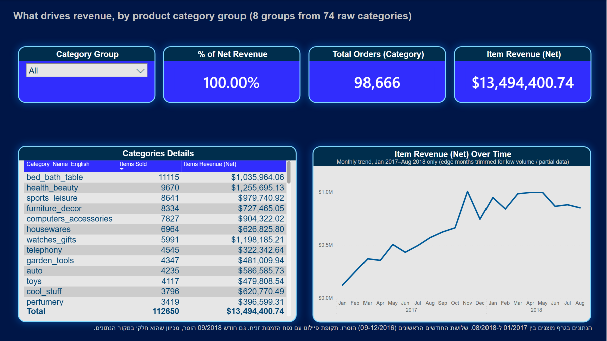
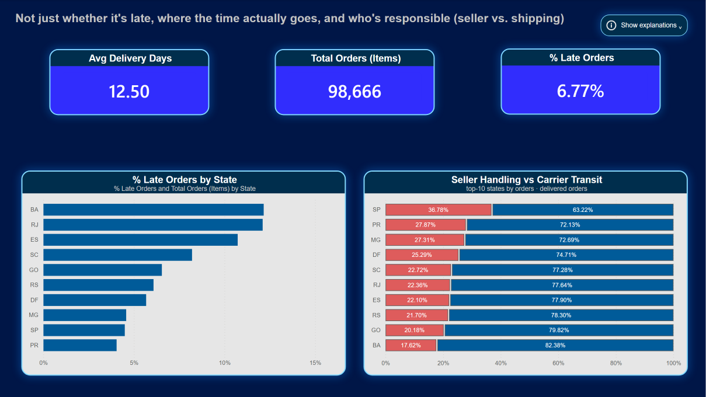
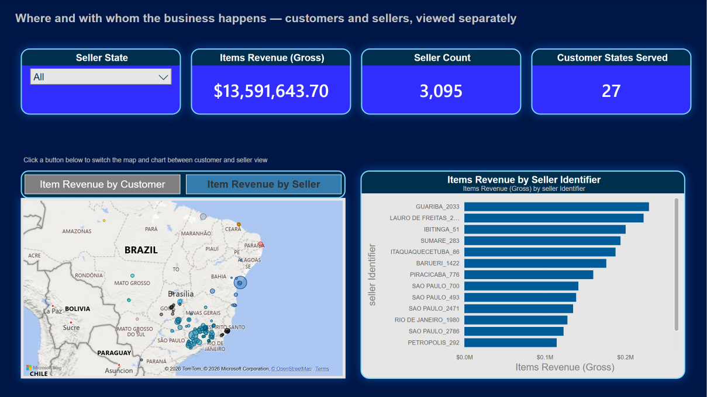
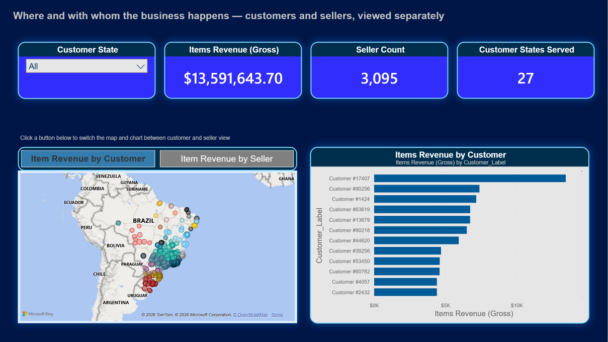
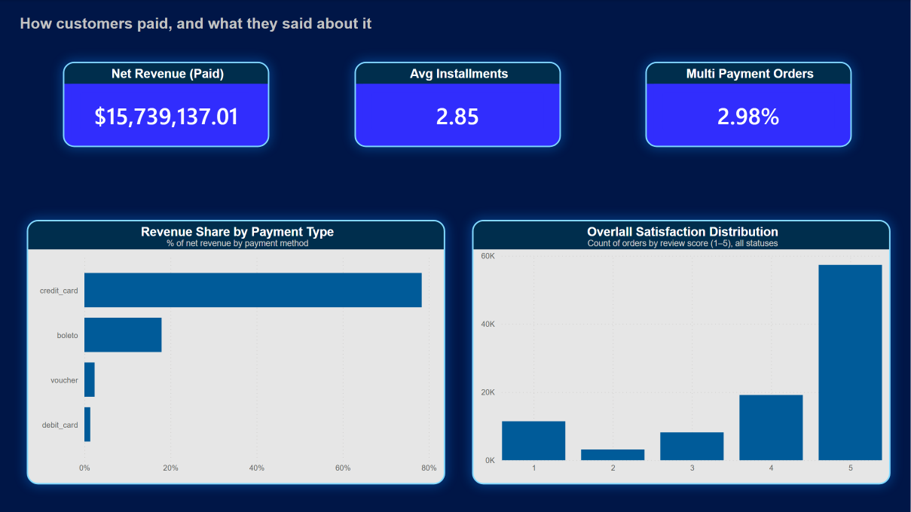
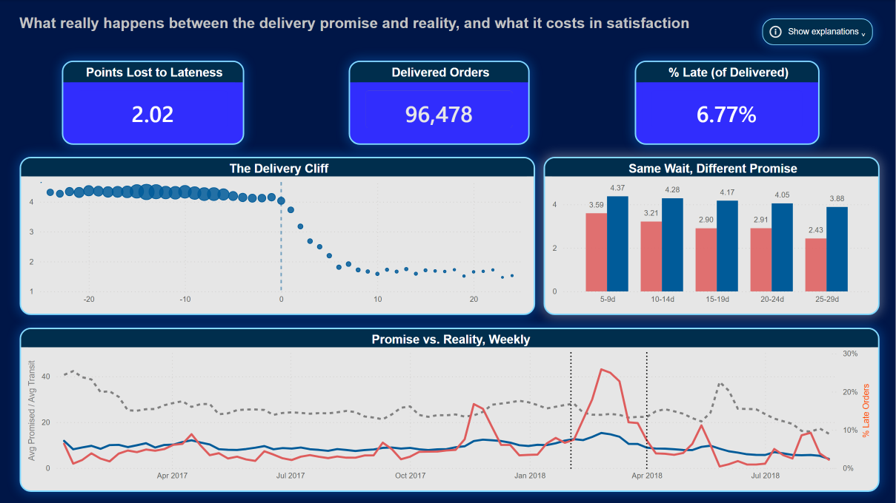

# Olist Brazilian E-Commerce — Data Warehouse & BI Capstone

End-to-end data engineering project: raw CSV → OLTP mirror → staging → dimensional data warehouse → Power BI dashboard. Built on the [Olist Brazilian E-Commerce dataset](https://www.kaggle.com/datasets/olistbr/brazilian-ecommerce) (Kaggle, ~2016–2018).

**Stack:** SQL Server · Power BI Desktop (Import mode) · DAX

## Business Questions
1. Delivery performance — delays vs. estimate, actual delivery times
2. Seller performance — who sells more, who sells well
3. Geographic segmentation — sales patterns by state/city
4. Customer reviews — how delays affect satisfaction
5. Payment behavior — payment types, installment usage

## Architecture

```
olist_db (OLTP mirror) → olist_STG (staging) → olist_DWH (dimensional model) → Power BI
```

- **olist_db** — 1:1 raw mirror of the Kaggle CSVs, no business logic, no PK/FK (added separately)
- **olist_STG** — cleaned copy (trimming, casing, category translation) with no grain changes
- **olist_DWH** — dimensional model, built as a **Fact Constellation**
- Every layer is rebuildable from SQL scripts alone — no manual steps

## Key Design Decision: Fact Constellation over Single Star

The initial design used one `Fact_Sales` table at order-item grain, with `Payment` and `Review` (both order-level) joined onto it. This **fan-out** inflated `SUM(Payment_Value)` and biased `AVG(Review_Score)` toward orders with more line items.

**Fix:** three fact tables, each at its own natural grain:

| Fact | Grain |
|---|---|
| `Fact_Order_Items` | `order_id` + `order_item_id` |
| `Fact_Payments` | `order_id` + `payment_sequential` |
| `Fact_Reviews` | `review_id` + `order_id` |

They share conformed dimensions (`Dim_Customer`, `Dim_Date`) and connect through `Dim_Order` as a common anchor — this makes grain violations structural (a broken JOIN) rather than a silent convention someone can forget.

## Data Model

| Dimension | Grain | Notes |
|---|---|---|
| `Dim_Customer` | `customer_unique_id` | Person-level, not order-level (96,096 vs. 99,441 rows) |
| `Dim_Order` | `order_id` | Shared anchor for all 3 facts: status, delivery address (delivery timing lives in `Fact_Order_Items` only — kept out of the dimension to avoid two disagreeing sources for the same fact) |
| `Dim_Seller` | `seller_id` | 3,095 sellers |
| `Dim_Product` | `product_id` | Includes `Category_Group` (8 rollup groups over 74 categories) |
| `Dim_Date` | `Date_Key` | Marked as a Power BI date table |

A circular relationship (`Dim_Date` ↔ Fact ↔ `Dim_Order` ↔ `Dim_Date`) was resolved by removing `Purchase_Date_Key` from `Dim_Order` — Power BI silently disables one of two active relationships between the same two tables, which is a correctness risk worth designing around rather than discovering later.

## Data Quality Findings
- `customer_id` (order-scoped) vs. `customer_unique_id` (person-scoped) — 99,441 vs. 96,096
- 775 orders with payment but no line items (~$162.6K) — items removed after cancellation, payment record remains
- 610 products with no category (~$179K revenue) — kept as `Unclassified`, not dropped
- Review score averages 4.16 for delivered orders vs. 1.28–2.5 for other statuses — satisfaction metrics are filtered to `delivered` by default

Full grain analysis and before/after proof queries: [`sql/05_analytical_flaws.sql`](sql/05_analytical_flaws.sql), [`sql/15_self_review_proofs.sql`](sql/15_self_review_proofs.sql).

## Dashboard — 5 Pages (Power BI, Import mode)

**1. Overview** — what's driving revenue, by product category group


**2. Where the Time Goes** — not just whether an order is late, but where the time goes and who's responsible (seller handling vs. carrier transit)


**3. Sellers & Geography** — a Bookmark toggle swaps the map and chart between a customer view and a seller view



**4. Payments & Customer Voice** — how customers paid, and what they said about it


**5. Delivery Promise & Satisfaction** — what really happens between the delivery promise and reality, and what it costs in satisfaction


## Repository Structure
```
sql/            01–15 numbered pipeline scripts (source → staging → DWH → verification)
docs/           Full technical documentation + dashboard screenshots
powerbi/        Theme JSON, DAX for Category_Group
mapping/        Source-to-Target mapping workbook (68 column mappings)
presentation/   Final capstone slide deck
```

## Running the Pipeline
Run in order: `01` → `02` → `03` (verify) → `04` → `07` (DWH DDL) → `08` (STG DDL) → `09` → `10` → `11` → `12` → `13` (verify) → `15` (proofs).
**`14` is a standalone SCD2/incremental-load demo — do not run against the live schema.**

Full design rationale and QA log: [`docs/Project_Documentation.md`](docs/Project_Documentation.md)

## Author
Tomer Choresh — Data Engineering & Analytics Capstone, Experis, 2026
